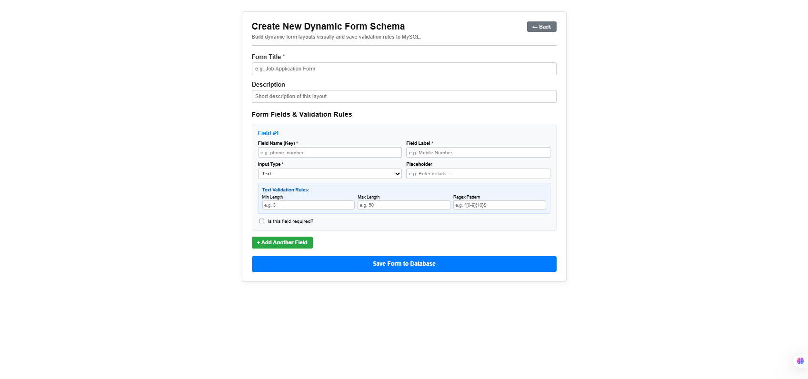
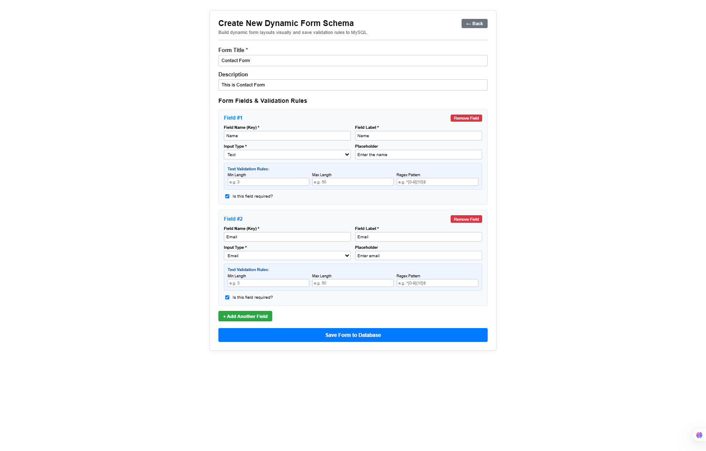
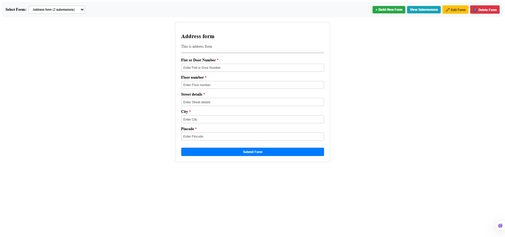
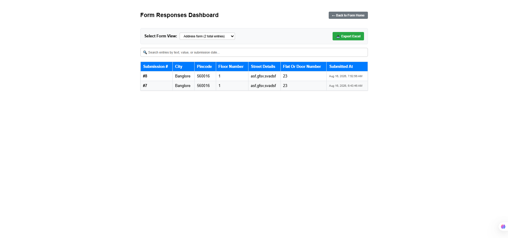

# Dynamic Form Builder (Full-Stack Angular & Node.js)

🚀 **Live Demo:** [https://angularprojects-fna4.onrender.com](https://angularprojects-fna4.onrender.com)

---

### 📌 Quick Test Instructions
You can instantly test the live application without setting up an account:
1. Open the **Live Demo link** above.
2. **Create/Build a Form:** Click on **+ Build New Form**, define custom input fields (Text, Number, Dropdown, etc.), configure validation rules (min/max bounds or Regex), and click **Save Form to Database**.
3. **Submit Data:** Select your newly generated form from the dropdown list on the home screen, fill out the dynamic fields, and hit **Submit Form**.
4. **View & Export Responses:** Click on **View Submissions** to view submitted entries in real time or click **Export Excel** to download all collected form entries into a `.xlsx` spreadsheet.

---

## 📸 Screenshots & UI Preview

| Create Form Schema | Edit Form Schema |
| :---: | :---: |
|  |  |

| Created Form Details / Submission View | Submissions Dashboard |
| :---: | :---: |
|  |  |

---

## 📖 About The Project

I built this application to solve a real-world problem: creating complex, customizable forms dynamically without needing to write new frontend UI components or manually update backend SQL database schemas every time a new field is needed. 

The application provides a visual UI where users can build form layouts, attach validation constraints (required fields, value ranges, and custom Regex patterns), and save them. The Angular frontend dynamically parses these rules into native reactive forms, while the Node.js/Express backend stores form schemas as structured JSON inside MySQL.

---

## 🛠 Tech Stack

### Frontend
* **Angular** (v19) - Single Page Application architecture built with standalone components.
* **Angular Reactive Forms & FormBuilder** - Dynamic form control generation and state management.
* **Bootstrap / CSS** - Responsive styling and UI controls.
* **ExcelJS** (v4.4.0) - In-browser generation and download of Excel spreadsheets for form submissions.
* **TypeScript** (v5.7.2) & **RxJS** (v7.8.0) - Reactive data handling and strict typing.

### Backend
* **Node.js & Express.js** - Lightweight REST API server handling request processing and database routing.
* **MySQL** (Hosted on Aiven Cloud) - Persistent storage using relational tables for schema metadata and JSON payloads.
* **`mysql2`** - Connection pooling for fast, asynchronous database queries.
* **`cors`** - Security middleware restricting API access exclusively to trusted origins.

---

## ✨ Key Features & Architecture Details

### Frontend Architecture
* **Dynamic Reactive Form Engine:** Generates `FormGroup` and `FormControl` trees programmatically at runtime based on the JSON schema fetched from the backend.
* **Custom Regex & Validation Parsing:** Evaluates backend-configured constraints (min/max lengths, numerical bounds, required flags, custom Regex patterns) and maps them directly to Angular `Validators`.
* **Dynamic Form Builder UI:** Allows users to visually add, reorder, or remove fields and set custom validation rules without touching code.
* **Spreadsheet Export:** Converts submitted JSON form records into formatted `.xlsx` files client-side using `exceljs`.

### Backend Architecture
* **Modular REST API:** Clean separation of concerns with dedicated routes (`/api/forms`) and controllers.
* **JSON Schema Storage in MySQL:** Keeps the MySQL table structure static while storing dynamic field definitions as flexible JSON strings, offering the flexibility of NoSQL inside a relational database.
* **CORS Protection:** Configured with origin filtering to secure backend endpoints against unauthorized cross-domain calls.

---

## 📁 Repository Structure

```text
├── frontend/             # Angular client application
│   ├── src/
│   │   ├── app/
│   │   │   ├── components/ # Form builder, form renderer, submissions UI
│   │   │   └── services/   # HTTP API integration services
│   └── angular.json
├── backend/              # Node.js Express server
│   ├── src/
│   │   ├── config/       # Database connection pool setup
│   │   ├── routes/       # Express route handlers
│   │   └── controllers/  # Core business logic & database queries
│   ├── index.js          # Server entry point
│   └── .env.example      # Environment variable template
├── images/               # Application screenshots for documentation
│   ├── form_schema.png
│   ├── edit_form_schema.png
│   ├── created_form_dtail.png
│   └── view_form_data.png
└── README.md
```

---

## 💻 Local Installation & Setup

Follow these steps to run the project locally on your machine:

### Prerequisites
* **Node.js** (v18 or higher)
* **npm** (v9 or higher)
* **MySQL Database** (Local instance or cloud connection like Aiven)

---

### 1. Clone the Repository
```bash
git clone https://github.com/vishnusaathyagi-17aa/AngularProjects.git
cd AngularProjects
```

---

### 2. Backend Setup

1. Navigate to the root/backend directory where `index.js` resides:
   ```bash
   cd backend
   ```
2. Install dependencies:
   ```bash
   npm install
   ```
3. Create a `.env` file in the backend folder and add your environment variables:
   ```env
   PORT=5000
   DB_HOST=your-mysql-host
   DB_PORT=your-mysql-port
   DB_USER=your-mysql-username
   DB_PASSWORD=your-mysql-password
   DB_NAME=dynamic_forms_db
   ```
4. Start the Node.js backend server:
   ```bash
   npm start
   ```
   *The backend will run on `http://localhost:5000`.*

---

### 3. Frontend Setup

1. Open a new terminal window and navigate to the frontend folder:
   ```bash
   cd frontend
   ```
2. Install frontend dependencies:
   ```bash
   npm install
   ```
3. Start the Angular local development server:
   ```bash
   npm start
   ```
   *(or `ng serve`)*
4. Open your browser and navigate to:
   ```text
   http://localhost:4200
   ```

---

## 🌐 API Endpoints Summary

| Method | Endpoint | Description |
| :--- | :--- | :--- |
| `GET` | `/api/forms` | Fetch list of all saved form schemas |
| `GET` | `/api/forms/:id` | Fetch a specific form schema by ID |
| `POST` | `/api/forms` | Save a new form schema definition |
| `DELETE` | `/api/forms/:id` | Delete a form schema |
| `POST` | `/api/forms/:id/submissions` | Save user form responses |
| `GET` | `/api/forms/:id/submissions` | Fetch all submitted responses for a form |

---

## 🛡️ License

Distributed under the MIT License. Feel free to use and modify for personal learning or commercial projects!